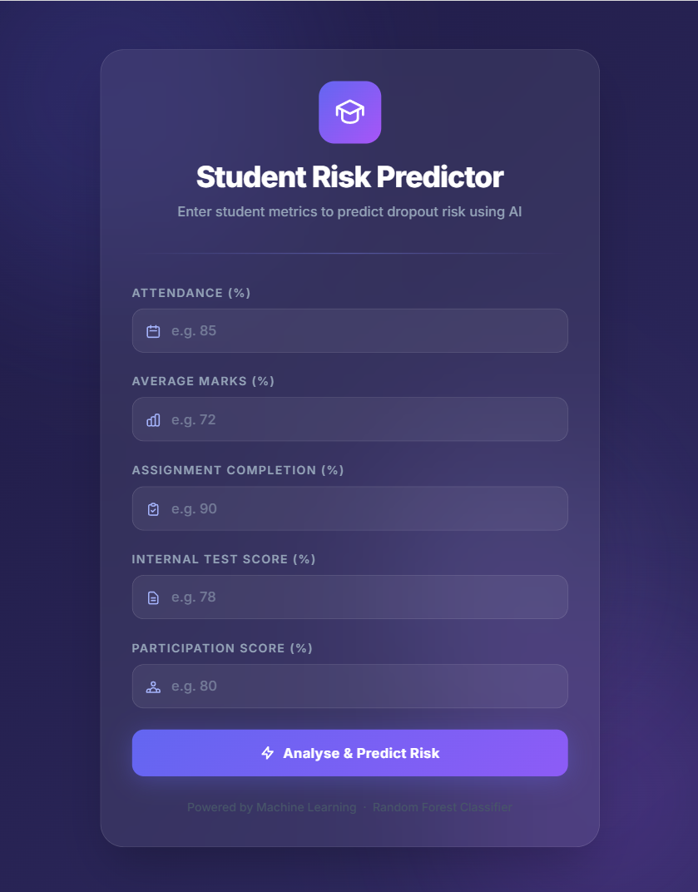

<div align="center">

# 🎓 Student Dropout Predictor

### An end-to-end Machine Learning web application that predicts whether a student is at risk of dropping out — based on their academic performance metrics.

[](https://python.org)
[](https://flask.palletsprojects.com)
[](https://scikit-learn.org)
[](LICENSE)

</div>

---

## 📸 Preview



---

## 🌟 What This Project Does

This project uses a **Random Forest Classifier** trained on synthetic student data to predict dropout risk in real time. A student's five key metrics are entered via a sleek web UI, and the model instantly returns:

- ✅ **Risk Level** — HIGH RISK or LOW RISK
- 📊 **Probability** — how confident the model is (e.g. 94%)
- 💡 **Recommendation** — a contextual action for the educator

---

## 🗂️ Project Structure

```
student_dropout_predictor/
│
├── data/
│   ├── dataset_generate.py    # Script that generates the synthetic CSV dataset
│   └── students.csv           # 1,000-student dataset (5 features + 1 target)
│
├── model/
│   ├── model.pkl              # Trained Random Forest model (serialized)
│   └── scaler.pkl             # StandardScaler used during training
│
├── templates/
│   └── index.html             # Jinja2 HTML template (glassmorphism UI)
│
├── explore.ipynb              # Jupyter Notebook: full EDA (charts, heatmaps, pairplot)
├── train.py                   # Model training script → generates model.pkl & scaler.pkl
├── app.py                     # Flask web server
├── requirements.txt           # Python dependencies
├── image.png                  # Screenshot of the web UI
└── .gitignore
```

---

## 🤖 Machine Learning Pipeline

| Step | Detail |
|------|--------|
| **Dataset** | 1,000 synthetic students · 80% safe · 20% at-risk |
| **Features** | `attendance`, `marks`, `assignments`, `tests`, `participation` |
| **Target** | `dropout` (0 = Not at Risk · 1 = At Risk) |
| **Preprocessing** | StandardScaler (fit on training data, applied to inputs at inference) |
| **Algorithm** | Random Forest Classifier (`n_estimators=100`, `class_weight='balanced'`) |
| **Evaluation** | Accuracy · Precision · Recall · F1 · Confusion Matrix |

### 📊 Feature Correlation with Dropout (from EDA)

| Feature | Pearson r |
|---------|-----------|
| assignments | **−0.86** |
| attendance | −0.81 |
| participation | −0.78 |
| marks | −0.76 |
| tests | −0.66 |

---

## 🚀 Getting Started

### 1. Clone the repository
```bash
git clone https://github.com/MH-Shomik/student-dropout-predictor.git
cd student-dropout-predictor
```

### 2. Create & activate a virtual environment
```bash
# Windows
python -m venv venv
venv\Scripts\activate

# macOS / Linux
python3 -m venv venv
source venv/bin/activate
```

### 3. Install dependencies
```bash
pip install -r requirements.txt
```

### 4. (Optional) Regenerate the dataset
```bash
python data/dataset_generate.py
```

### 5. Train the model
```bash
python train.py
```

### 6. Run the web app
```bash
python app.py
```
Then open **http://127.0.0.1:5000** in your browser.

---

## 🖼️ How to Use the App

1. Enter the student's **Attendance %**, **Marks %**, **Assignment Completion %**, **Test Score %**, and **Participation Score %**.
2. Click **Analyse & Predict Risk**.
3. The model returns a result card showing the **risk level**, **probability**, and a **recommendation for the educator**.

---

## 📦 Dependencies

```
Flask
scikit-learn
pandas
numpy
joblib
matplotlib
seaborn
```

Install all at once:
```bash
pip install -r requirements.txt
```

---

## 📓 Exploratory Data Analysis

The `explore.ipynb` notebook covers:

- `df.head()` / `df.describe()` — data preview & statistics
- `df.isnull().sum()` — missing value check
- Class distribution (bar + pie)
- Feature distributions by dropout status (overlapping histograms)
- Correlation heatmap (`df.corr()`)
- Box plots per class
- Pairplot coloured by target

---

## 🏗️ Tech Stack

| Layer | Technology |
|-------|-----------|
| Language | Python 3.13 |
| ML Library | scikit-learn |
| Data | pandas · numpy |
| Visualisation | matplotlib · seaborn |
| Web Framework | Flask |
| Frontend | HTML5 · Tailwind CSS · Vanilla JS |
| Model Serialisation | joblib |

---

## 👤 Author

**MH Shomik**  
[GitHub](https://github.com/MH-Shomik)

---

## 📄 License

This project is licensed under the **MIT License** — free to use, modify, and distribute.

---

<div align="center">
<sub>Built as a portfolio project to demonstrate end-to-end ML engineering skills.</sub>
</div>
